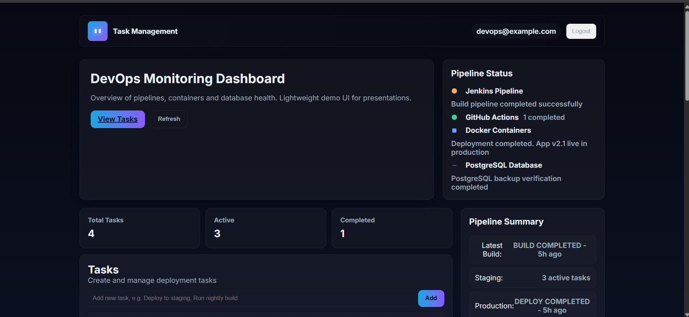
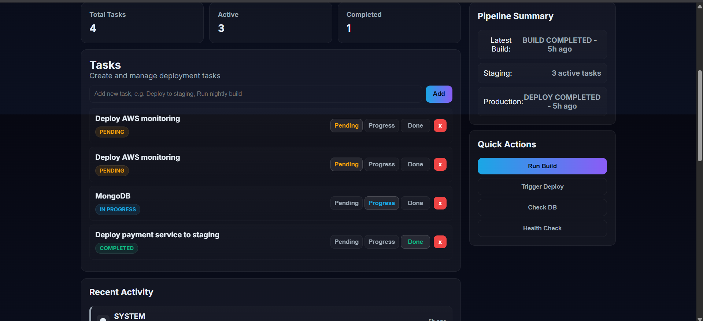
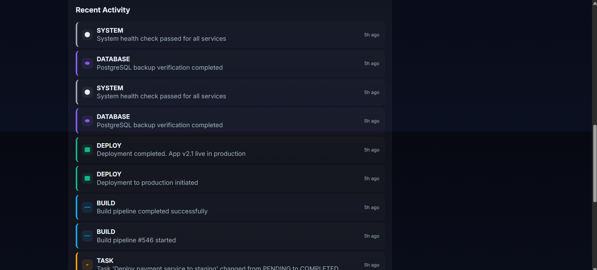
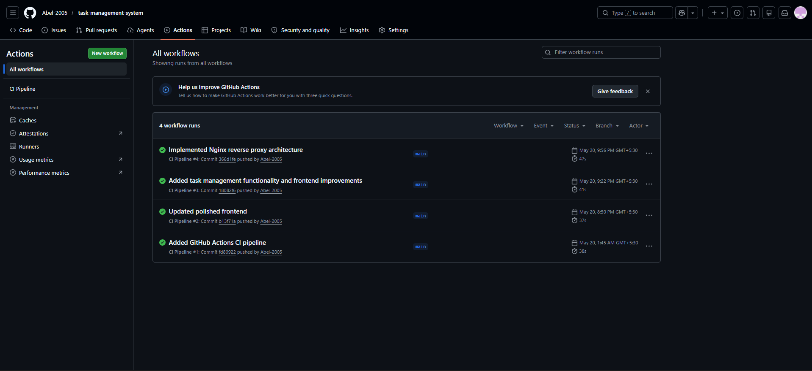
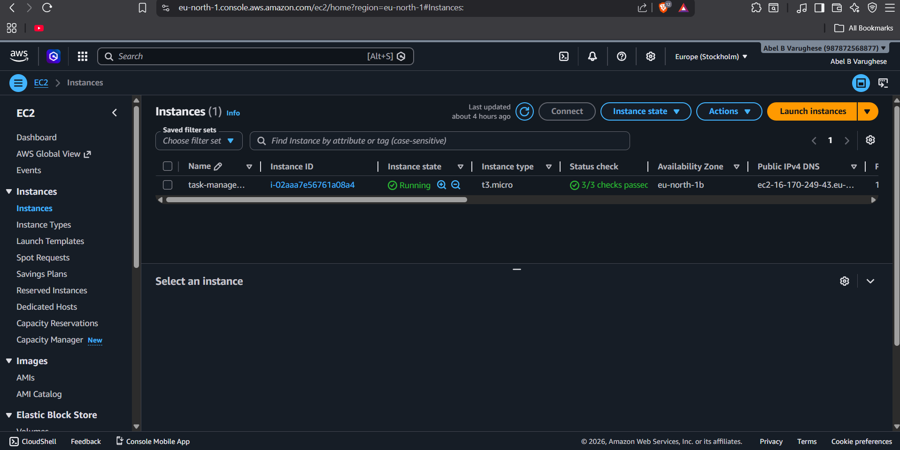

# DevOps Task Management System

A production-style cloud-hosted DevOps dashboard application demonstrating CI/CD pipelines, Docker containerization, reverse proxy architecture, AWS EC2 deployment, PostgreSQL persistence, and modern DevOps workflow simulation.

The project combines a modern SaaS-style frontend with a Dockerized Spring Boot backend and cloud deployment infrastructure.

---

# Project Overview

This project was designed to demonstrate real-world DevOps concepts using a lightweight but production-inspired Task Management and DevOps Operations Dashboard.

The application simulates a DevOps control panel where users can:

* Manage tasks
* Track task statuses
* Simulate deployment/build actions
* Monitor dashboard metrics
* View dynamic activity logs
* Interact with backend APIs through a reverse proxy

The system is fully Dockerized and deployed on AWS EC2 using CI/CD workflows.

---

# Key Features

## Frontend Features

* Modern dark SaaS-style DevOps dashboard
* Responsive enterprise-style UI
* Dynamic task management system
* Task status badges
* Dynamic dashboard counters
* Dynamic recent activity feed
* Mock DevOps operation controls
* Realistic monitoring-style cards

---

## Task Management Features

### Task Status System

Tasks support:

* Pending
* Progress
* Done

Features include:

* Colored status badges
* Dynamic task updates
* Automatic dashboard counter updates
* PostgreSQL persistence

---

## Dynamic Dashboard Metrics

The dashboard dynamically updates:

* Total Tasks
* Active Tasks
* Completed Tasks
* Pipeline Status
* Deployment Status
* Backend Health
* Database Status

---

## Dynamic Activity Feed

The Recent Activity section is fully dynamic.

Activity categories include:

| Activity Type | Color  |
| ------------- | ------ |
| Build         | Blue   |
| Deploy        | Green  |
| Task          | Amber  |
| Database      | Purple |
| System        | Muted  |

The activity feed supports:

* timestamps
* newest-first ordering
* backend-driven updates
* live frontend rendering

---

## DevOps Action Simulation

The dashboard includes interactive DevOps action buttons:

* Run Build
* Trigger Deploy
* Check DB
* Health Check

These simulate realistic DevOps operations by:

* creating backend activity events
* updating dashboard cards
* refreshing recent activity dynamically
* simulating pipeline workflows

---

# Tech Stack

## Frontend

* HTML
* CSS
* JavaScript
* Nginx

## Backend

* Java 17
* Spring Boot
* Spring Data JPA

## Database

* PostgreSQL

## DevOps & Infrastructure

* Docker
* Docker Compose
* GitHub Actions
* Jenkins
* AWS EC2
* Nginx Reverse Proxy

---

# System Architecture

## Application Architecture

```text
User
  ↓
Nginx Reverse Proxy
  ├── Frontend Dashboard
  └── Spring Boot Backend API
            ↓
       PostgreSQL Database
```

---

## CI/CD Flow

```text
Developer
   ↓
GitHub Repository
   ↓
GitHub Actions (CI)
   ↓
Jenkins Pipeline (CD)
   ↓
Docker Compose
   ↓
AWS EC2 Deployment
```

---

# Reverse Proxy Architecture

Nginx is configured as a centralized reverse proxy.

## Routing

| Route  | Destination        |
| ------ | ------------------ |
| /      | Frontend Dashboard |
| /api/* | Spring Boot APIs   |

Benefits:

* cleaner architecture
* single public entry point
* internal container networking
* production-style deployment design

---

# Backend API Features

## Task APIs

| Method | Endpoint        | Purpose     |
| ------ | --------------- | ----------- |
| GET    | /api/tasks      | Fetch tasks |
| POST   | /api/tasks      | Create task |
| DELETE | /api/tasks/{id} | Delete task |

---

## DevOps Action APIs

| Endpoint                   | Purpose                      |
| -------------------------- | ---------------------------- |
| /api/tasks/action/build    | Simulate build pipeline      |
| /api/tasks/action/deploy   | Simulate deployment          |
| /api/tasks/action/database | Simulate DB health check     |
| /api/tasks/action/health   | Simulate system health check |

---

## Activity Feed API

| Method | Endpoint      |
| ------ | ------------- |
| GET    | /api/activity |

---

# Dockerized Architecture

The project uses Docker Compose for orchestration.

## Services

| Service       | Purpose                |
| ------------- | ---------------------- |
| reverse-proxy | Centralized routing    |
| frontend      | Dashboard UI           |
| auth-service  | Spring Boot backend    |
| database      | PostgreSQL persistence |

---

# CI/CD Features

## GitHub Actions

Used for Continuous Integration.

Pipeline tasks:

* repository checkout
* Java setup
* Maven build
* Docker validation
* build verification

---

## Jenkins

Used for Continuous Deployment workflow simulation.

Responsibilities:

* automated deployment workflows
* Docker deployment automation
* Maven build orchestration
* pipeline simulation

---

# AWS Deployment

The application is deployed on an AWS EC2 Ubuntu instance.

Deployment stack includes:

* Docker Engine
* Docker Compose
* Nginx Reverse Proxy
* Spring Boot backend
* PostgreSQL database

---

# Frontend Enhancements

## UI Improvements

Implemented improvements include:

* modern dark enterprise dashboard styling
* polished cards and spacing
* responsive layout
* modern status badges
* cleaner typography
* improved dashboard hierarchy
* production-style DevOps aesthetic

---

## Frontend Build Fixes

Additional deployment fixes include:

* cache-busted frontend asset loading
* no-cache reverse proxy headers
* frontend image rebuild support
* Docker Compose frontend build integration

---

# Project Structure

```text
task-management-system/
│
├── auth-service/                # Spring Boot backend
├── frontend/                    # Frontend dashboard
├── nginx/                       # Reverse proxy configuration
├── .github/workflows/           # GitHub Actions CI pipeline
├── docker-compose.yml           # Docker orchestration
├── Jenkinsfile                  # Jenkins pipeline
└── README.md
```

---

# Local Setup

## Prerequisites

Install:

* Docker Desktop
* Java 17
* Maven
* Git

---

## Clone Repository

```bash
git clone https://github.com/Abel-2005/task-management-system
cd task-management-system
```

---

## Build Backend

```bash
cd auth-service
mvn clean package -DskipTests
cd ..
```

---

## Start Application

```bash
docker compose up --build -d
```

---

# Access Application

## Frontend Dashboard

```text
http://localhost/dashboard.html
```

---

## Backend APIs

```text
http://localhost/api/tasks
```

```text
http://localhost/api/activity
```

---

# AWS Deployment Workflow

## Connect to EC2

```bash
ssh -i devops-key.pem ubuntu@YOUR_PUBLIC_IP
```

---

## Pull Latest Changes

```bash
git pull
```

---

## Rebuild Application

```bash
sudo docker compose down
sudo docker compose up --build -d
```

---

# Key DevOps Concepts Demonstrated

* CI/CD Pipelines
* Docker Containerization
* Reverse Proxy Architecture
* Cloud Deployment
* Docker Networking
* Service Orchestration
* Infrastructure as Code
* REST APIs
* PostgreSQL Persistence
* AWS Cloud Hosting
* Deployment Automation
* Monitoring Dashboard Simulation

---


# Screenshots

## Dashboard Overview


---

## Task Management System


---

## Dynamic Activity Feed


---

## GitHub Actions CI Pipeline


---

## AWS EC2 Deployment



---

# Future Improvements

Potential future upgrades:

* JWT Authentication
* HTTPS/SSL support
* Kubernetes deployment
* Docker Hub integration
* Prometheus/Grafana monitoring
* Role-based access control
* Real Jenkins webhook integration

---

# Learning Outcomes

This project demonstrates practical experience with:

* Cloud deployment
* DevOps workflows
* Dockerized infrastructure
* CI/CD pipelines
* Reverse proxy configuration
* Spring Boot backend development
* PostgreSQL integration
* Modern frontend dashboard design
* Deployment automation
* Full-stack cloud-hosted architecture

---

# Author

Abel B Varughese

GitHub:
[https://github.com/Abel-2005](https://github.com/Abel-2005)
